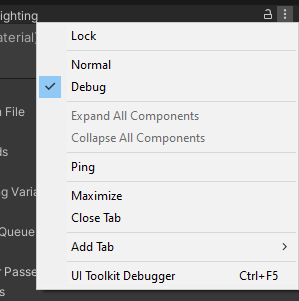
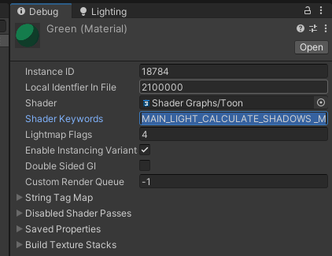

A toon shader graphs (and also a compiled shader) (made in Unity)

After putting the shader:
1) Switch to debug mode in inspector (the 3 dots) 
2) Add these keywords to the material `MAIN_LIGHT_CALCULATE_SHADOWS _MAIN_LIGHT_SHADOWS_CASCADE _SHADOWS_SOFT ADDITIONAL_LIGHT_CALCULATE_SHADOWS` 
3) Should work, tested on (and also made on) 2020.3.33f